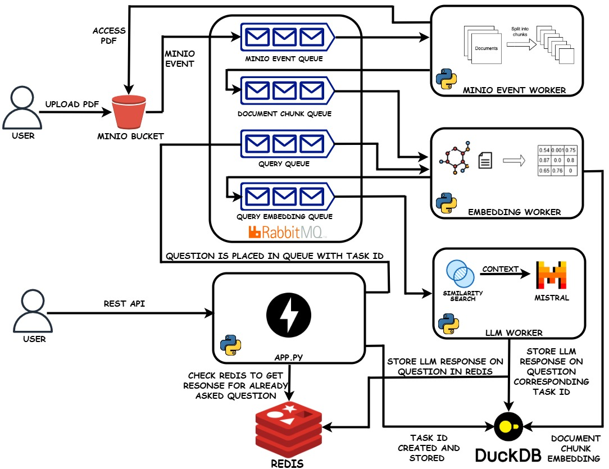

# Scalable RAG LLM Chatbot System

A Retrieval-Augmented Generation (RAG) chatbot that allows users to upload documents and ask questions, receiving contextually accurate answers powered by a quantized Mistral-7B LLM.

---



## 📖 Table of Contents

- [Project Overview](#project-overview)
- [Architecture](#architecture)
- [Tech Stack](#tech-stack)
- [Prerequisites](#prerequisites)
- [Installation & Setup](#installation--setup)
- [Usage](#usage)
- [Project Structure](#project-structure)
- [Scripts & Workers](#scripts--workers)
- [API Endpoints](#api-endpoints)
- [Configuration](#configuration)
- [Extending the Project](#extending-the-project)
- [Contributing](#contributing)
- [License](#license)
- [Contact](#contact)

---

## 📝 Project Overview

This project implements a **Retrieval-Augmented Generation (RAG)** system to power a document-aware chatbot. Users can upload PDF documents to a local MinIO bucket, ask questions via a FastAPI endpoint, and receive answers generated by the quantized Mistral-7B LLM using retrieved document context.

Key features:
- Document ingestion and chunking
- Semantic embedding storage and retrieval
- Async task handling with RabbitMQ queues
- FastAPI-based question submission and polling
- Answer caching in Redis and DuckDB

---

## 🏗️ Architecture

```plaintext
User Upload → MinIO → MinIO Event Queue (RabbitMQ)
  ↳ minio_event_worker → Document Chunk Queue
    ↳ embedding_worker → DuckDB (embeddings)

User Query → FastAPI → Query Queue
  ↳ embedding_worker → Query Embedding Queue
    ↳ llm_worker → Similarity Search (DuckDB)
       ↳ Mistral-7B → Answer → DuckDB & Redis

Client polls FastAPI with task_id → Returns answer
```
---

## 💻 Tech Stack

| Component      | Technology                   |
| -------------- | ---------------------------- |
| API            | FastAPI                      |
| Object Storage | MinIO                        |
| Queueing       | RabbitMQ                     |
| Embedding DB   | DuckDB                       |
| Cache          | Redis                        |
| Embeddings     | Sentence Transformer         |
| LLM            | Quantized Mistral-7B         |

---

## 🔧 Prerequisites

- [Python 3.10+](https://www.python.org/downloads/)
- [Docker (optional)](https://www.docker.com/)
- Bash shell (Linux/macOS) or WSL on Windows
- Git

---

## 🚀 Installation & Setup

1. **Clone the repository**
   ```bash
   git clone https://github.com/yourusername/scalable-rag-llm-chatbot.git
   cd scalable-rag-llm-chatbot
   ```

2. **Install dependencies**
   ```bash
   pip install -r requirements.txt
   ```

3. **Configure credentials**
   Update `app/config/minio_config.json`, `rabbitmq_config.json`, and `redis_config.json` with your endpoints and credentials.

4. **Start services & workers**
   ```bash
   cd script
   bash startup_script.sh
   ```

5. **Launch FastAPI**
   ```bash
   cd ../app
   python app.py
   ```

---

## ⚙️ Usage

1. **Upload a document**
   - Use the web UI of minio server.

2. **Submit a question**
   - `POST /ask` with JSON:
     ```json
     { "question": "What is RAG?" }
     ```
   - Response:
     ```json
     { "task_id": "abc123" }
     ```

3. **Retrieve the answer**
   - `GET /result/{task_id}`
   - Response:
     ```json
     { "task_id": "abc123", "answer": "Retrieval-Augmented Generation (RAG) ..." }
     ```

---

## 🗂️ Project Structure

```plaintext
project_root/
├── script/                  # Service startup scripts
│   ├── start_minio.sh
│   ├── start_rabbitmq.sh
│   ├── start_redis.sh
│   ├── start_workers.sh
│   ├── start_scripts.sh
│   └── startup_script.sh
├── app/                     # FastAPI app and modules
│   ├── app.py               # REST API endpoints
│   ├── logs/                # Application and worker logs
│   ├── config/              # MinIO, RabbitMQ, Redis configs
│   ├── embeddings/          # DuckDB database files
│   ├── models/              # SentenceTransformer & Mistral-7B
│   ├── services/            # Initialization scripts
│   ├── utilities/           # Client and DB utilities
│   └── worker/              # Worker scripts (minio, embedding, llm)
└── requirements.txt
```

---

## 🛠️ Scripts & Workers

| Script / Worker                | Description                                                    |
| ------------------------------ | -------------------------------------------------------------- |
| `start_minio.sh`              | Starts MinIO, creates bucket, sets up event notification       |
| `start_rabbitmq.sh`           | Starts RabbitMQ, declares queues                               |
| `start_redis.sh`              | Starts Redis, syncs cache from DuckDB                          |   
| `start_scripts.sh`            | Starts start_minio.sh, start_rabbitmq.sh and start_redis.sh    |
| `start_workers.sh`            | Starts minio_event_worker.py, embedding_worker.py and llm_worker.py |
| `startup_script.sh`           | Starts all script(single script to run whole necessary script of project)                          |
| `minio_event_worker.py`       | Listens for MinIO uploads → chunks and enqueues documents      |
| `embedding_worker.py`         | Embeds document chunks & queries → stores embeddings/queues    |
| `llm_worker.py`               | Performs similarity search, prompts LLM, stores answers        |

---

## 🔌 API Endpoints

| Endpoint                | Method | Request Body                         | Description                           |
| ----------------------- | ------ | ------------------------------------ | ------------------------------------- |
| `/ask`                  | POST   | `{ "question": "..." }`         | Submit a question, returns `task_id` |
| `/result/{task_id}`     | GET    | —                                    | Retrieve answer by `task_id`         |
| `/health`   | GET |   —   | Return status of rabbitmq, database and redis servers               |

---

## ⚙️ Configuration

Configuration files live in `app/config/`:

- `minio_config.json`  – MinIO endpoint, access key, secret key
- `rabbitmq_config.json` – RabbitMQ host, port, credentials
- `redis_config.json`    – Redis host, port, credentials

---

## 🌱 Extending the Project

- **Vector DB**: Swap DuckDB with Faiss, Qdrant, or ChromaDB for larger corpora.
- **Streaming**: Add WebSockets/SSE for real-time answer streaming.
- **Deployment**: Containerize with Docker and orchestrate with Kubernetes.
- **Security**: Implement authentication/authorization for document access.
- **Custom Models**: Fine-tune embeddings or LLMs on domain-specific corpora.

---

## 🤝 Contributing

1. Fork the repository
2. Create a new branch (`git checkout -b feature/YourFeature`)
3. Commit your changes (`git commit -m 'Add YourFeature'`)
4. Push to the branch (`git push origin feature/YourFeature`)
5. Open a Pull Request

---

## 📄 License

This project is licensed under the MIT License. See `LICENSE` for details.

---

